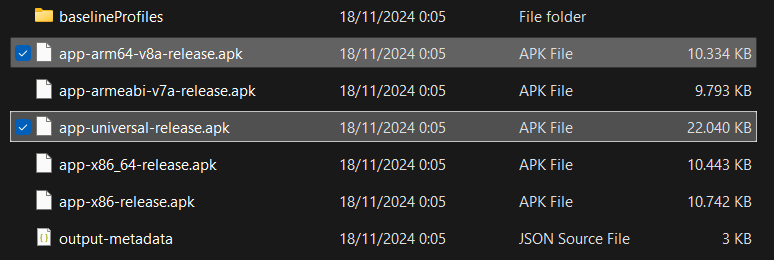

# Flip Transaction Application

This project is a submission for the **React Native Mobile Developer Recruitment Test** by Flip. It implements a simple transaction application with a focus code cleanliness, simplicity, performance optimization, and UI/UX consistency.

## Table of Contents

1. [Overview](#overview)
2. [Features](#features)
3. [Tech Stack](#tech-stack)
4. [Performance Approaches](#performance-approaches)
5. [Optimize App Size](#optimize-app-size)
6. [Installation](#installation)
7. [Usage](#usage)
8. [Folder Structure](#folder-structure)
9. [Improvements and Highlights](#improvements-and-highlights)

## Overview

The Flip Transaction Application consists of two pages:

1. **Transaction List Page**: Displays a list of transactions with functionalities for search, filter, and sort.
2. **Detail Page**: Displays detailed information about a specific transaction when a list item is pressed.

## Features

### Transaction List Page

- Displays all transactions retrieved from the [API](https://recruitment-test.flip.id/frontend-test).
- Search and filter by:
  - Transaction name
  - Sender bank
  - Beneficiary bank
  - Transaction amount
- Sort by:
  - Name (A-Z, Z-A)
  - Date (Newest, Oldest)
- Supports debounced input for the search bar to reduce re-render.

### Detail Page

- Displays all relevant information about the selected transaction.
- Includes a back button for navigation.

## Tech Stack

This project uses KISS (Keep It Simple and Straightforward) principle, a minimal and straightforward tech stack to ensure simplicity, maintainability, and performance. While state management libraries were not used due to the simplicity of the current requirements, the architecture supports scalability and can accommodate state management in the future if needed.

- **React Native**: Framework for building cross-platform applications.
- **TypeScript**: Enhances code quality and reduces runtime errors.
- **React Navigation**: For seamless navigation between pages.
- **Custom Hooks**: Implemented reusable logic for data fetching and state management.

## Performance Approaches

### Minimized Render Times

- **Memoization**: Used `React.memo` for components and `useMemo`/`useCallback` hooks to prevent unnecessary re-renders.
- **FlatList Optimization**: Utilized `keyExtractor` to improve list rendering performance.
- **Debounced Search**: Implemented debounce logic for search input to reduce the frequency of re-renders.

### Import Optimization

- Organized and imported only necessary modules to reduce bundle size.
- Used lazy loading for screens to improve initial load time.
- Utilized module resolver (alias) for cleaner and more readable import paths.

### API Optimization

- Implemented caching for API responses using a custom hook to prevent redundant network calls.

### Component Modularization

- Split components into smaller, reusable units to enhance maintainability and reusability.

### Other Enhancements

- **Hermes Engine (Android)**: Hermes is an optimized JavaScript engine for React Native. It improves performance, especially for Android. Read more at https://reactnative.dev/docs/hermes

# 
To ensure optimal performance, you can run the app and profile it using Open Dev Tools. Monitor the performance on each screen, and if the frame rate stays under 17ms, it signifies excellent app performance.

Here’s a snapshot of the profiling results:


This consistent performance ensures smooth user interactions across all screens and a seamless experience for users.

You also can download results of [profiling data here](./docs//profiling-data.11-18-2024.14-00-09.json)


## Optimize App Size

- Removed Unused Dependencies: Ensured no unnecessary libraries are included in the project, reducing the overall size.
- Code Splitting: Applied lazy loading for screens and heavy components to minimize the initial bundle size, improving performance and reducing load time.
- Minification: Leveraged React Native's built-in optimization tools during production builds, such as JavaScript minification and dead-code elimination, to further reduce the size of the final APK.
- Compression of Native Libraries: Used the legacy behavior of compressing native libraries in the APK file to reduce the overall APK size.
- Enabled Proguard: Activated Proguard for code shrinking, obfuscation, and optimization, which reduces the size of the APK and improves security.

Reducing the app's build size is crucial for ensuring a smooth experience, particularly for users with limited storage or slower network speeds. Through optimization, I’ve significantly minimized the APK size, resulting in a more efficient app:

- Optimized APK (arm64-v8a): [Download the optimized APK here (7.8 MB)](https://drive.google.com/file/d/1DRIepAsszxNYx2ktfey-BBR1ZfA1RXTG/view?usp=sharing).
- In case your devices with different architectures, [download the universal APK here (19.6 MB)](https://drive.google.com/file/d/1MUeRHtDeLiivgEXeDGydECpPSJrNQY3y/view?usp=sharing).

This optimization not only reduces download size and installation time but also ensures efficient storage usage, all while delivering reliable performance across a variety of devices.

Here are transformations:
<div style="justify-content: space-around; gap: 10px; width:500px">
  
  
  
</div>

## Installation

1. Clone the repository:
   ```bash
   git clone https://github.com/rezarffahlevi/flip_test.git
   ```
2. Install dependencies:
   ```bash
   cd flip_test
   npm install
   ```
3. Run the application:
   ```bash
   npm run android # For Android
   npx pod-install ios && npm run ios # For iOS
   ```

## Usage

1. Launch the app on your emulator or physical device.
2. Navigate to the Transaction List Page to view transactions.
3. Use the search bar or filter/sort options to refine the list.
4. Tap on a transaction to navigate to the Detail Page.

## Folder Structure

```plaintext
src/
├── assets/             # Static assets such as images, fonts, and icons used in the application
├── components/         # Reusable UI components, including shimmer and form elements
├── hooks/              # Custom hooks for encapsulating reusable logic (e.g., API fetching)
├── routes/             # Navigation setup, including route definitions and configurations
├── screens/            # Screen components for each page (e.g., Transaction List and Detail Page)
├── themes/             # Centralized style definitions, including colors, typography, and global styles
├── utils/              # Utility functions and helpers (e.g., debouncing, data formatting)
```

## Improvements and Highlights

- Reusable Hooks: Custom hooks (e.g., useFetchData) simplify data fetching.
- Code Comments: Added comments to clarify logic and assumptions.
- Git Commit Messages: Followed conventional commit guidelines for clear history.
- Gitflow: Adopted a structured branching strategy (e.g., main, develop, feature, and hotfix branches) to streamline collaboration and ensure organized development workflows.
- Edge Case Handling: Tested and handled edge cases (e.g., empty search results, API failures).
- UI Consistency: Adhered to mockup designs and ensured **responsive** behavior across devices.

#

Thank you for reviewing this project. I hope it meets the expectations and showcases my ability to build scalable, maintainable, and performant applications.
